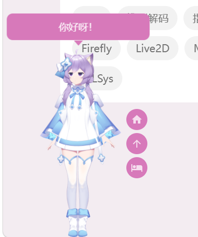
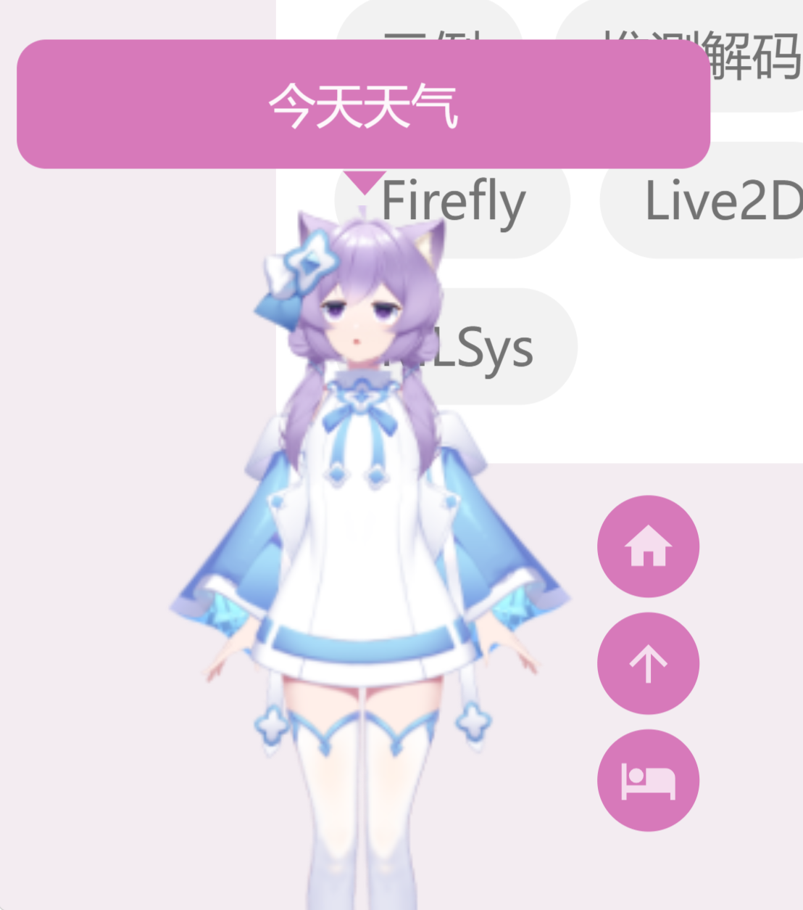

# Firefly配置Live2D看板娘心得

笔者最近心血来潮，想给博客diy 1 个纱露朵的看板娘，踩了不少坑，时间紧张，最终还是爆米选了现成的，想记录下中间的历程，就写了这篇文章。

---

## 0. Live2D 还是 Spine?

Firefly支持两种类型的**动态2D引擎**来渲染看板娘，**Live2D和Spine**。这两种引擎能够根据数据对象进行动画插值，在运行时自动计算关键帧之间的数据，具有体积更小、更少美术资源要求、更好的动画流畅效果、动画混合、可程序控制等优点。

Live2D由日本程式编写人员中城哲也发明，其大致思想是把角色分成不同的**图层**，这些图层被**单独控制移动**，从而显示整个角色的动作。图层的划分可粗可细，可以简单分为面部，头发和身体，也可以详细到眉毛，睫毛，甚至如果创作者希望的话，头发本身也可以用多个图层。


《碧蓝航线》Live2D交互

Spine采取了另外的方式：将图片划分为多个**蒙皮**，绑定到**骨骼**上，然后通过控制骨骼实现动画。这么做能够减少美术需求，还可实现网格分层、皮肤切换等功能，适合高帧率和高质量动画的场景。


《NIKKE：胜利女神》Spine立绘

Spine和Live2D的最大区别为：**Spine工作流是骨骼＋蒙皮，而Live2D则是通过变形器来对网格进行变换。** 这个区别当然不是绝对的，Spine通过调整网格顶点的位置可实现网格变换；Live2D中也有类似骨骼蒙皮的概念，其方法是使用旋转变形器当作骨骼，通过蒙皮功能生成胶水，为胶水固定住的相邻图层的顶点设置权重。

总体来说，Live2D更擅长刻画**细致的人物表情，及眼球跟随等交互动作**，比较好上手，更适合虚拟主播、直播互动等情形；而Spine能够快速制作**头发、飘带等飘动动画，和战斗场景的大幅度肢体动作**，学习曲线较陡，适合游戏和专业动画制作。在博客场景下，笔者决定选择Live2D制作看板娘。

---

## 1. 模型准备

笔者的话：本来想下个cubism手搓live2d模型的，急头白脸找了1圈 ~~（其实就是想看纱露朵美图了）~~ 才找到喜欢的图，切片的时候才发现天塌了，然后花了大概20r买了个量贩版本，再加上ai神力才勉强配好（

该Live2D模型包括下面几部分：

```l
maimai-salt
├─ icon.jpg                         
├─ items_pinned_to_model.json   
├─ maimai-salt.cdi3.json
├─ maimai-salt.moc3                 ← 模型网格数据        
├─ maimai-salt.model3.json          ← 入口文件
├─ maimai-salt.physics3.json        ← 物理效果
├─ maimai-salt.vtube.json           ← vtuber动作效果
├─ 哭哭.exp3.json                   ← 表情文件 
├─ 生气.exp3.json   
└─ maimai-salt.4096                 ← 贴图文件
   ├─ texture_00.png
   ├─ texture_01.png
   ├─ texture_02.png
   ├─ texture_03.png
   ├─ texture_04.png
   └─ texture_05.png
```

解包大小19M，贴图占了大头（大致17MB），moc文件2MB。

我看了下firefly的看板娘示例，示例中是200x200的大小，而贴图的是4096x4096的，是为1080p+的虚拟主播而设计的，这里无需那么高的分辨率。由于`.moc3`文件用的是 0-1 之间的相对位置，我就地把贴图缩小为2048x2048，总大小变为7MB，而画质无明显损失。

---

## 2. 模型配置

将模型放在`public/pio/models/live2d/maimai-salt/`目录下，按照文档所说的配置，在`pioConfig.ts`改下模型位置、大小即可，目前看来没明显问题,live2d和Spine只能二选1.

效果图：



实测发现，纱露朵能够眨眼，但不能动嘴。问了下claude，SDK能够自动识别EyeBlink并填充眨眼动作，而动嘴的需代码驱动。查live2d文档，发现`typing`配置能够在控制对话框内 打字速度和动作，在`pioConfig.ts`的`tips`内加入下面的几行，就完成了：

```ts
typing: {
    param: "ParamMouthOpenY",   // Live2D 标准嘴部参数          
    speed: 200,                   // 打字速度（ms/字），默认 100
    minValue: 0.5,               // 嘴巴最小开合度 0-1
    maxValue: 1,                 // 嘴巴最大开合度 0-1
},
```

随后在`Live2DWidget.astro`的228-239行加入了微笑嘴型设置（ParamMouthForm=1）：

```js
const widget = createWidget(options);   // ParamMouthForm 初始化为 1（微笑嘴型）  
if (widget?.l2d) {
const initMouthForm = () => {          
try { widget.l2d?.setParams({ ParamMouthForm: 1 }); } catch (_){} };
      if (widget.l2d.on) {
          widget.l2d.on("loaded", initMouthForm);  // 模型加载时设置
      }
      setTimeout(initMouthForm, 2000);              // 兜底延迟再试一次
  }
```

最终效果：



---

参考文献：

[Live2D - 维基百科](https://zh.wikipedia.org/wiki/Live2D)

[【Live2D/Spine】动态2D引擎分析 - 知乎](https://zhuanlan.zhihu.com/p/715770763)

[Spine: In depth - esoteric software](https://en.esotericsoftware.com/spine-in-depth)

[Spine与Live2D的区别：动画制作的两大利器 - 酱油派](https://www.jiangyoupai.com/p/g_rLO_EzN6BY-_t1O_rRj)


