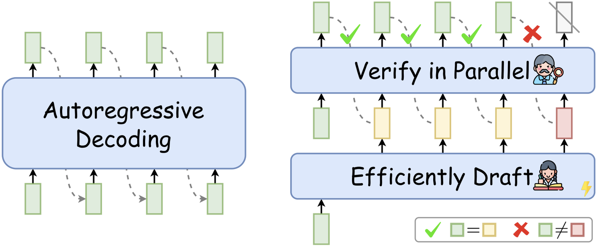
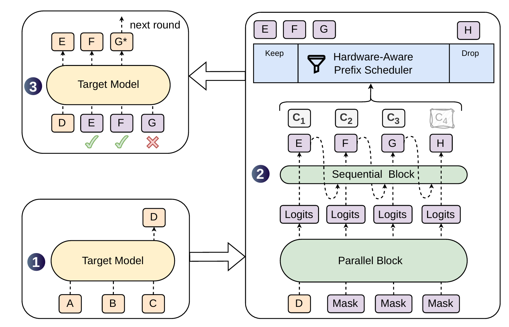
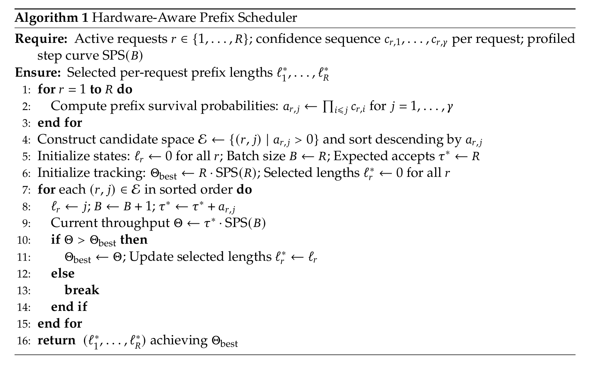
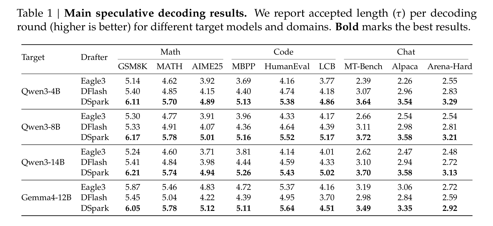
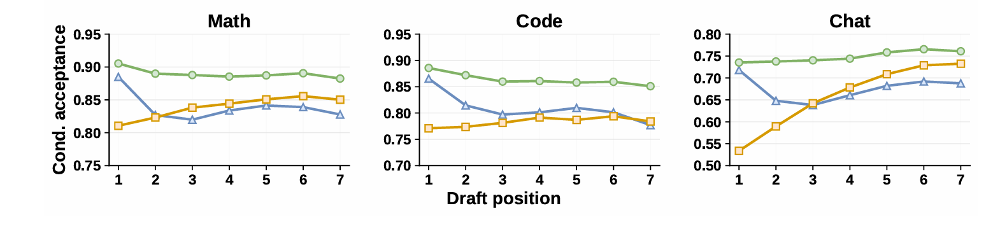
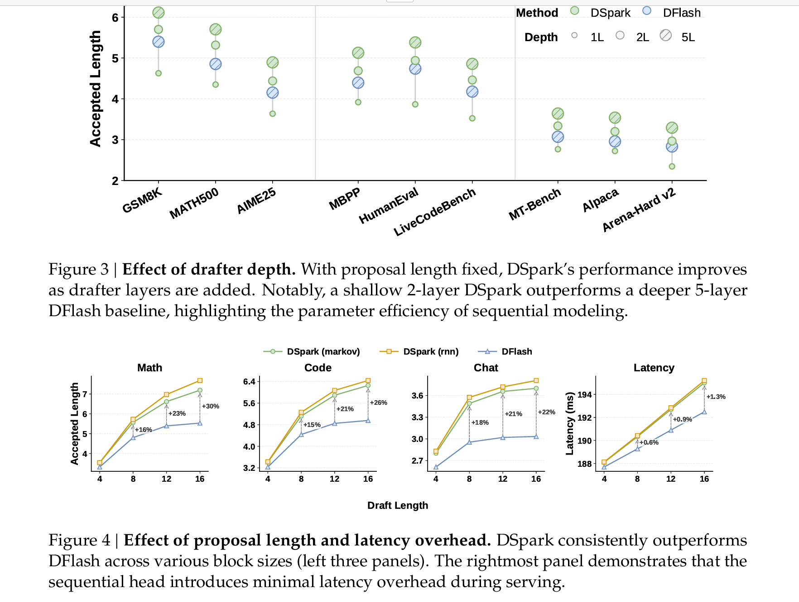
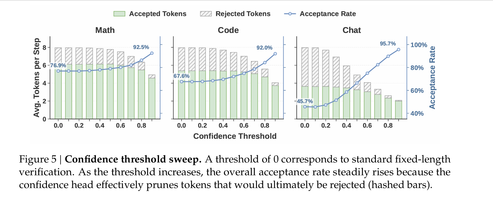
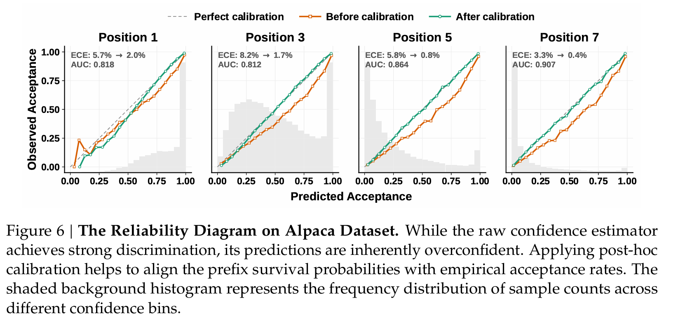

# DSpark论文笔记

---

[原文传送门](https://arxiv.org/abs/2607.05147)

## 0. 前置知识：推测解码

推测解码的idea：先由**草稿模型**(draft model)快速地推测后面的1个token块；再让目标模型本体经过**单次**前向传播，**并行验证**整个 token 块，接受最长前缀并加1个奖励token。推测解码的好处是增加了并行性，减少了推理所需的步数，缓解了decode阶段memory-bound问题。理论上，目标模型验证能够保证解码结果完全一致。

加快推测解码有三种方式：**（1）加快草稿模型速率，（2）增加草稿的准确性，（3）加快验证过程。**

---

## 1. DSpark概述

现有的草稿模型分为2类：**自回归模型**和**并行模型**。相比自回归草稿模型，并行模型1次传播就能生成下个token块，生成速率较高；但并行解码没法建模token间的相互关联，这会降低接受率。此外，token块的长度很难确定，短了效率低，长了会增加验证的负担，降低吞吐量。

DSpark的方法：对第1点，采取了**半自回归**的架构，在并行解码的基础上，通过1个轻量的自回归头，引入token间关联；对第2点，采取**置信度调度验证机制**，调度器根据token的接受概率估计，

---

## 2. DSpark草稿模型架构

DSpark草稿模型架构如下图：

解码过程分为2个阶段：

- **并行阶段**：1遍前向传播，产生隐藏状态 $h_1 ... h_\gamma$ 及基础逻辑值 $U_1 ... U_\gamma$ 。论文在[DFlash](https://arxiv.org/abs/2602.06036)解码器的基础上做了些修改，输入改为anchor 及 $\gamma -1$（不是 $\gamma$ ）个mask，减少计算量。

- **串行阶段**：产生**前缀相关**的偏置 $B$ ，加到 $U$ 上，作为最终逻辑值。具体来说，第 $k$ 个位置选取token $v$ 的概率如下：

$$p_k( v\ | x_0, x_{<k} ) = \frac{\exp(U_k(v)+B_k( v\ | x_0, x_{<k}))}{\sum_{u\in V}\exp(U_k(u)+B_k( u\ | x_0, x_{<k}))}$$

串行阶段，自回归头分为下面两种：

- **马尔可夫式**：当前token的B值仅被上个token所决定。
- **RNN式**：在马尔可夫的基础上，维护内部状态 $s_k$ ，表达能力更强，但是计算较重。

## 3. 置信度调度验证

影响验证阶段性能的瓶颈主要有两个：**（1）不同domain的接受率不同**，结构化程度高的输出（如代码）接受率高，而开放性的任务（如开放性聊天）接受率低。**（2）不同负载下验证的代价不同，** 低负载下，多验证 1个token不会带来太多代价；而高负载下，验证会拖垮整体性能。

解决方法：（1）置信度头； （2）硬件感知前缀调度器。

### 3.1 置信度头

对（1）来说，我们需要1个手段，事先知道每个请求多大概率被接受。论文作者就增加了置信度头，对此给出估计。

置信度头：对每个位置 $k$ ，给出 $h_k$ 和 $x_{k-1}$, 用置信度头生成它的**置信度** $c_k=\sigma(\omega^T[h_k;W_1[x_{k-1}]])$， 用来估计 **之前的token被接受的条件下，$k$ 处token被接受的概率** 。为了求出参数，论文作者用 $c^*=1-\frac{1}{2}\lVert p_d - p_t\rVert _1$ 来学习c，其中 $p_t$ 为目标模型的概率分布， $p_d$ 为草稿模型的概率分布。

推导： 验证时，每个token被选中的概率为 $min(1,\frac{p_t(k)}{p_d(k)})$, 化为对 $k$ 的求和则为 $c^*=\sum_k p_d(k) min(1,\frac{p_t(k)}{p_d(k)}) = \sum_k min(p_d(k), p_t(k)) = \frac{1}{2}(\sum p_d(k) + \sum p_t(k) - \sum |p_d(k)-p_t(k)|)$

单纯通过置信度头估计往往会虚高，如果估计每个位置通过的概率$\Pi_{i=1}^kc_i$的话，这种虚高还会被不断放大。因此论文作者还采取了**顺序温度缩放**(Sequential Order Scaling, STS)的方法，通过1d网格搜索，寻找温度 $T_i$（ $\sigma$ 内部的缩放factor），使得当前位置上 $\Pi_{i=1}^kc_i$ 的误差最小。

### 3.2 硬件感知前缀调度器

硬件感知前缀调度器是验证的核心创新点。其idea大致如下：**将验证长度的选择视为吞吐量的最大化问题，然后用贪心思路求解。**

具体来说， 考虑总请求数为 $R$ 的 batch 。对第 $r$ 个请求，其每个位置的置信度为 $c_{r,1},...c_{r,\gamma}$，存活概率 $a_{r,j} = \Pi_{i\le j}c_{r,i}$ 。记 $l_r$ 为系统给该位置分配的验证长度，则token的吞吐量可估计为 $\Theta = \tau \cdot \text{SPS}(B)$， 其中 $B=\sum_r(l_r+1)$ 表示batch的实际大小 ，$\tau = \sum_r (\sum_{j=1}^{l_r}a_{r,j} + 1)$ 表示该batch接受的token总数（包括bonus token），而$\text{SPS}(B)$表示batch的吞吐量。

对这a问题，增加a个token对 $\tau$ 的**贡献**为 $a_{r,j}$， 而这a贡献在序列内部是**单调递减**的。因此，在 $B$ 大小确定的情况下，**我们能够贪心地选取贡献最大的若干个 $a$， 同时保证每个序列的token是从头开始且连续的。** 为了选取最佳的 $B$，我们可从零开始，逐个选取 $a$ 最大的token，并计算 $\Theta = \tau \cdot \text{SPS}(B)$，从而找到最大值。

但是，这么做存在问题：**如果找的是全局的最大值，那么后面的token会间接affect当前token是否进入验证过程。** 举个例子，如果当前token求出的 $\Theta$ 相对较低，但下个接受概率（$x_{k-1}$ 是当前token注入的）能够弥补当前token的不足，那么当前token是否进入验证，就间接地被当前token的属性本身所决定，形成选择偏差。因此，**token本身的属性会改变它是否能够被验证这件事本身，从而改变它的接受概率。** 而如果**一旦当前吞吐量 $\Theta$ 不再提升，立即停止并返回当前最优解**，就会在“当前token求出的 $\Theta$ 相对较低”这里拦截掉，这保证了token是否进入验证不会被其自身所决定，从而确保了准确性。

算法的具体过程如下：

---

## 4. 实验

论文作者选择了 Qwen3-{4B, 8B, 14B} 和 Gemma4-12B 作为目标模型，Eagle3 和 DFlash做草稿模型，并选择 Open-PerfectBlend 数据集训练草稿模型。为保证草稿模型和目标模型相似，作者只选取了提示词，回复从目标模型重新生成。论文作者选择数学、代码、日常聊天3方面的benchmark，测评接收长度 $\tau$ 。

结果如下：

结果分析：

- **并行（DFlash）和半并行（DSpark）草稿模型的接受长度比自回归草稿模型（Eagle3）长。** 作者分析了之前序列全部被接受的情况下，每个位置的接受率。结果显示，（1）第1个位置接受率，并行比串行高，这来自并行模型表现力更强的架构； ~~（是不是anchor token的干扰）~~ （2）之后的接受率上，串行逐渐提升，并行衰减较剧烈，半并行使得趋势得到了缓解。

- **串行头能显著提升接受长度，且提升比例随序列变长而增加，所带来的时间开销极小。** 此结论详见 Figure3 及 Figure4。

- **置信度头能够很好地减除不必须的token。** 作者对置信度的阈值进行了扫描，发现token接受率随阈值增加而提升（图5）；作者还观察到置信度头的估计值往往偏高，而STS调整能够较好地缓解该现象（图6）。

---

参考文献：

[LLM推理加速新范式！推测解码（Speculative Decoding）最新综述](https://zhuanlan.zhihu.com/p/678404136)
[deepseek Dspark推测解码论文详解](https://zhuanlan.zhihu.com/p/2054600384749080830)
[【LLM技术论文】《DSpark：基于置信度调度与半自回归生成的推测解码》](https://zhuanlan.zhihu.com/p/2054575771377725634)
